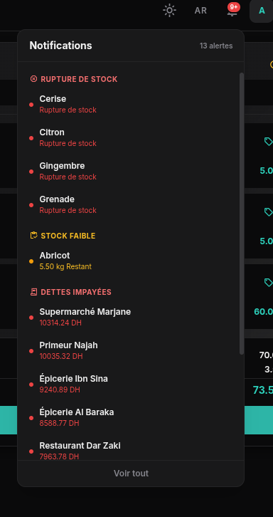

# Jemla POS

> **Point of Sale & Business Management System for Wholesale Fruit & Vegetable Distribution**

[](https://reactjs.org/)
[](https://expressjs.com/)
[](https://sqlite.org/)
[](https://tailwindcss.com/)
[](https://gsap.com/)

---

## 🖼️ Screenshots

| Dashboard (Light)                                       | Dashboard (Dark)                                           |
| ------------------------------------------------------- | ---------------------------------------------------------- |
|  |  |

| POS Terminal (Light)                     | POS Terminal (Dark)                            |
| ---------------------------------------- | ---------------------------------------------- |
|  |  |

| Products                                        | Customers                                    |
| ----------------------------------------------- | -------------------------------------------- |
|  |  |

| Reports (FR)                                  |
| --------------------------------------------- |
|  |

| Reports (Dark)                                         |
| ------------------------------------------------------ |
|  |

| Reports (AR)                                           |
| ------------------------------------------------------ |
| .png>) |

| Settings                                     | Notifications                                   |
| -------------------------------------------- | ----------------------------------------------- |
|  |  |

---

## 📖 The Story

Jemla POS was born from a real problem faced by a local **Moroccan wholesale fruit & vegetable dealer** — a "Jemla" market trader who struggled to keep track of his business.

Before this application, everything was done **on paper and by memory**:

- Sales recorded in notebooks, easily lost or misplaced
- Customer debts tracked mentally or on loose scraps of paper
- Inventory managed by walking through the warehouse
- No visibility into daily profits, trends, or performance

This application was built to bring order, clarity, and professionalism to a business that deserves it. It digitizes the entire workflow — from sale to debt collection — into a clean, bilingual (French/Arabic), dark-mode-capable POS system that works entirely offline with a local database.

---

## ✨ Features

### 🏪 Point of Sale Terminal

- Product grid with **category filtering**, **search**, and **barcode scanning**
- **Favorites system** for quick-access products
- Real-time cart with **quantity presets** (1/2/5/10 kg), increment/decrement, and direct numpad entry
- **Wholesale pricing** — auto-switches when quantity meets minimum threshold
- Per-item **discounts** (fixed or percentage) and **tax exemption**
- **Payment methods**: Cash, Card, Digital Transfer, Credit
- Cash payments: enter amount received — **change auto-calculated**
- Credit payments: partial deposit, remaining tracked as **debt**
- **Sale-level discount** with quick presets (-10, -20, -50 DH)
- **Delivery management**: address, date, delivery fee
- **Order holding** (suspend & restore)
- **Keyboard shortcuts**: F1 shortcuts, F2 search, F4 cart, Ctrl+H hold, Ctrl+P pay
- **Invoice modal** with print-friendly layout after each sale

### 📊 Dashboard

- **KPI cards**: today's sales, client debts, stock alerts, transaction count
- **Sales trend chart** (daily/weekly) with previous-period comparison
- **Top 3 products** and **best customer** highlights
- **Payment distribution** donut chart (cash, card, transfer, credit)
- **Recent transactions** table with status badges

### 📦 Products & Inventory

- Full product management: name, category, barcode, retail/wholesale pricing, unit, minimum wholesale qty
- **Real-time stock tracking** with low-stock thresholds
- **Inventory adjustment log** with reasons
- **Stock status indicators**: normal, low, out-of-stock

### 👥 Customers & Debts

- Customer management with contact info, addresses, delivery address
- **Debt tracking** per customer with running balance
- **Payment collection** with method and notes
- Purchase history per customer

### 🤝 Suppliers & Purchases

- Supplier management (name, phone, email, address)
- Purchase order recording — **auto-updates inventory**

### 🔄 Returns

- Process returns with reasons: damaged, quality, overripe, order error, dissatisfaction
- **Auto-restocks** inventory on return

### 📈 Reports

- Period-based summaries: all-time, today, week, month, year
- **Sales by category** breakdown
- Export: **CSV** download, **PDF/Print** with optimized styles

### ⚙️ Settings

- **General**: default payment method, default customer, stock threshold
- **Appearance**: dark/light theme, language (Français / العربية), receipt customization
- **Backup**: one-click full database download
- **User management**: add/edit/delete users (admin or cashier role)
- **Account**: password change

### 🌍 Global Features

- **Bilingual** — French (default) and Arabic with full **RTL support**
- **Dark/Light theme** — system-aware with manual toggle
- **Global search** — search products, customers, and sales from the header
- **Notification system** — real-time alerts for low stock, debts, held orders
- **GSAP animations** — smooth page transitions and card reveals
- **Print-optimized CSS** — clean receipts and reports
- **Responsive** — mobile-friendly with collapsible sidebar and cart drawer

---

## 🛠️ Tech Stack

| Layer | Tech |
|---|---|
| **Frontend** | React 19, React Router 6, Tailwind CSS 3, shadcn/ui |
| **State & Data** | React Context, SQLite via sql.js |
| **Charts** | Recharts |
| **Internationalization** | i18next, react-i18next (FR / AR) |
| **Animations** | GSAP |
| **Icons** | Lucide React, Material Symbols |
| **Backend** | Node.js, Express 4 |
| **Auth** | Passport.js (local), bcrypt, express-session |
| **Database** | SQLite (via sql.js — no external DB server needed) |
| **Build Tool** | Vite 5 |

---

## 🚀 Getting Started

### Prerequisites

- **Node.js** 18+ installed

### Installation

```bash
# 1. Clone the repository
git clone https://github.com/your-username/Jemla-POS.git
cd Jemla-POS

# 2. Install frontend dependencies
npm install

# 3. Install backend dependencies
cd server && npm install && cd ..

# 4. Run both frontend and backend in development mode
npm run dev        # Frontend (Vite dev server on port 5173)
npm run dev:server # Backend (Express API server on port 3000)
```

The backend automatically creates the SQLite database and seeds it with demo data on first run.

### Default Credentials

| Role        | Username  | Password     |
| ----------- | --------- | ------------ |
| **Admin**   | `admin`   | `admin123`   |
| **Cashier** | `cashier` | `cashier123` |

---

## 📁 Project Structure

```
├── src/                    # React frontend
│   ├── components/         # UI components (sidebar, header, POS components)
│   │   ├── layout/         # App layout, sidebar, header
│   │   └── ui/             # shadcn/ui components
│   ├── pages/              # Route pages (Dashboard, POS, Products, etc.)
│   ├── context/            # React context (Auth)
│   ├── hooks/              # Custom hooks (usePageReveal)
│   ├── lib/                # Utilities (formatting, export, validation)
│   ├── services/           # API client
│   ├── locales/            # Translation files (fr.json, ar.json)
│   ├── i18n.js             # i18next configuration
│   └── App.jsx             # Router setup
├── server/                 # Express backend
│   └── src/
│       ├── index.js        # Server entry point
│       ├── db.js           # SQLite initialization
│       ├── passport.js     # Auth strategy
│       ├── seed.js         # Demo data seeder
│       ├── routes/         # API route handlers
│       └── middleware/     # Auth middleware
├── screenshots/            # App screenshots
├── vite.config.js          # Vite configuration
├── tailwind.config.js      # Tailwind CSS configuration
└── package.json            # Frontend dependencies
```

---

## 🔌 API Overview

The backend exposes a RESTful JSON API at `http://localhost:3000/api/`:

| Endpoint                  | Purpose                     |
| ------------------------- | --------------------------- |
| `POST /api/auth/login`    | Authenticate user           |
| `GET /api/dashboard`      | Dashboard stats & charts    |
| `GET/POST /api/products`  | Product CRUD                |
| `GET/POST /api/customers` | Customer CRUD               |
| `GET/POST /api/suppliers` | Supplier CRUD               |
| `GET/POST /api/sales`     | Sales management            |
| `GET/POST /api/purchases` | Purchase management         |
| `GET/POST /api/returns`   | Returns management          |
| `GET/POST /api/inventory` | Inventory tracking          |
| `GET /api/debts`          | Debt monitoring             |
| `GET /api/reports`        | Sales reports               |
| `GET /api/notifications`  | Alerts (stock, debts, held) |
| `GET/PUT /api/settings`   | Application settings        |

---

## 🌐 Localization

The interface is available in **French** (default) and **Arabic**. Arabic layout supports full **RTL** (right-to-left) text direction, mirrored sidebar, and proper Arabic number formatting.

Switch languages from the header dropdown or Settings page.

---

## 🧠 Architecture Notes

- **Self-contained**: No external database server. SQLite stores everything in a single file.
- **Offline-capable**: All data lives locally — no cloud dependency.
- **Role-based auth**: Admin has full access; Cashier has restricted access suitable for daily POS operations.
- **Seeded demo data**: 70+ products, 20 customers, 8 suppliers, and 90 days of realistic transactions — ready to explore immediately.
- **Barcode support**: Products can be scanned or searched by barcode at the POS.

---

## 📄 License

MIT

---
